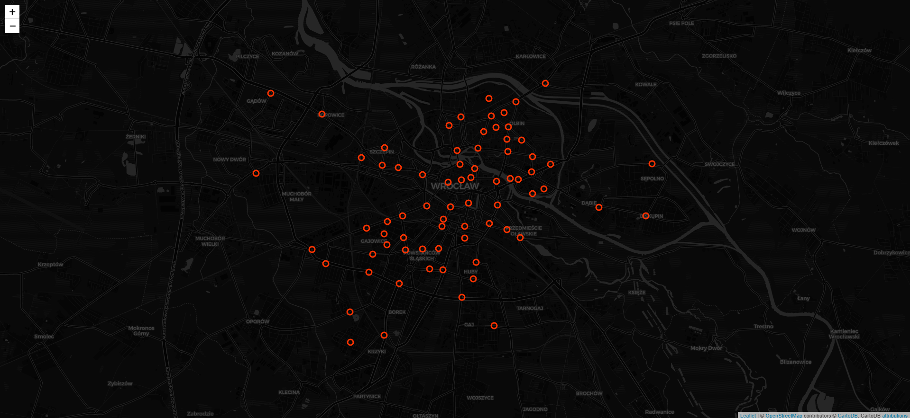
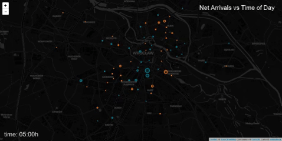

Wroclaw Bikesharing System Analysis
==============================

# Overview

As part of the free transport data service, Wroclaw Bikesharing System (WRM) release data on journeys taken using their cycles. The data goes back to June 2019, showing information on the start and end locations of the journey, along with duration and time of day. By combining this information with the coordinates of each cycle hire point, I predicted the most likely journey taken for each start/end combination.

# The WRM data

Wroclaw host all of the raw cycle data on their [open data website](https://www.wroclaw.pl/open-data/dataset/wrmprzejazdy_data) as a series of CSV files. Furthermore, they also have [data](https://www.wroclaw.pl/open-data/dataset/nextbikesoap_data) showing the status of each bike point in Wroclaw, yielding information such as its coordinates, total capacity etc.

For those unaware, below is a map of all the cycle hire stations across Wroclaw and surrounding areas.

I've also generated a fancy interactive version of this plot in folium - click [here](https://sebastian-konicz.github.io/WRM/images/DockingStationsMapBlack.html) to see it. You can zoom/scroll with this version, and it also tells you the name and capacity of each location.

Project Organization
------------

    ├── LICENSE
    ├── Makefile           <- Makefile with commands like `make data` or `make train`
    ├── README.md          <- The top-level README for developers using this project.
    ├── data
    │   ├── external       <- Data from third party sources.
    │   ├── interim        <- Intermediate data that has been transformed.
    │   ├── processed      <- The final, canonical data sets for modeling.
    │   └── raw            <- The original, immutable data dump.
    │
    ├── docs               <- A default Sphinx project; see sphinx-doc.org for details
    │
    ├── models             <- Trained and serialized models, model predictions, or model summaries
    │
    ├── notebooks          <- Jupyter notebooks. Naming convention is a number (for ordering),
    │                         the creator's initials, and a short `-` delimited description, e.g.
    │                         `1.0-jqp-initial-data-exploration`.
    │
    ├── references         <- Data dictionaries, manuals, and all other explanatory materials.
    │
    ├── reports            <- Generated analysis as HTML, PDF, LaTeX, etc.
    │   └── figures        <- Generated graphics and figures to be used in reporting
    │
    ├── requirements.txt   <- The requirements file for reproducing the analysis environment, e.g.
    │                         generated with `pip freeze > requirements.txt`
    │
    ├── setup.py           <- makes project pip installable (pip install -e .) so src can be imported
    ├── src                <- Source code for use in this project.
    │   ├── __init__.py    <- Makes src a Python module
    │   │
    │   ├── data           <- Scripts to download or generate data
    │   │   └── make_dataset.py
    │   │
    │   ├── features       <- Scripts to turn raw data into features for modeling
    │   │   └── build_features.py
    │   │
    │   ├── models         <- Scripts to train models and then use trained models to make
    │   │   │                 predictions
    │   │   ├── predict_model.py
    │   │   └── train_model.py
    │   │
    │   └── visualization  <- Scripts to create exploratory and results oriented visualizations
    │       └── visualize.py
    │
    └── tox.ini            <- tox file with settings for running tox; see tox.testrun.org

--------

<small>Project based on the <a target="_blank" href="https://drivendata.github.io/cookiecutter-data-science/">cookiecutter data science project template</a>. #cookiecutterdatascience</small>

