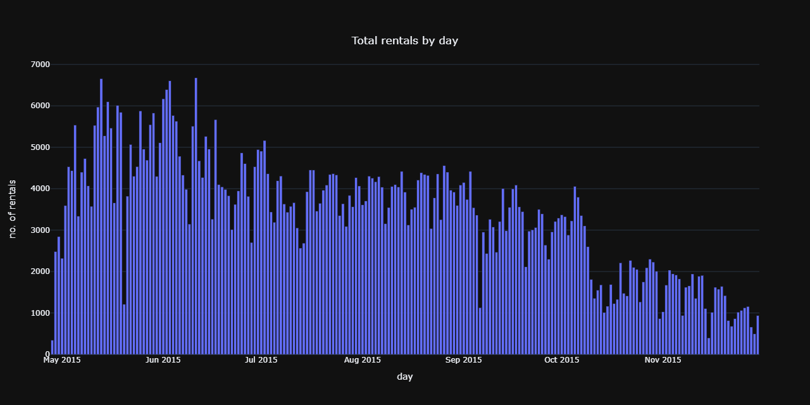
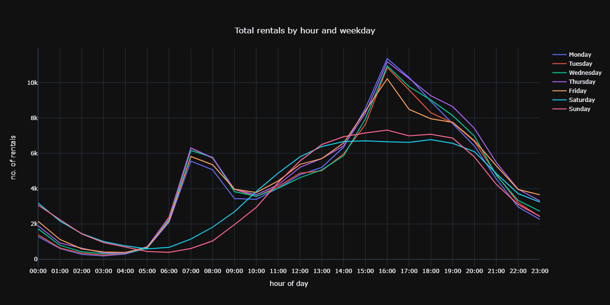
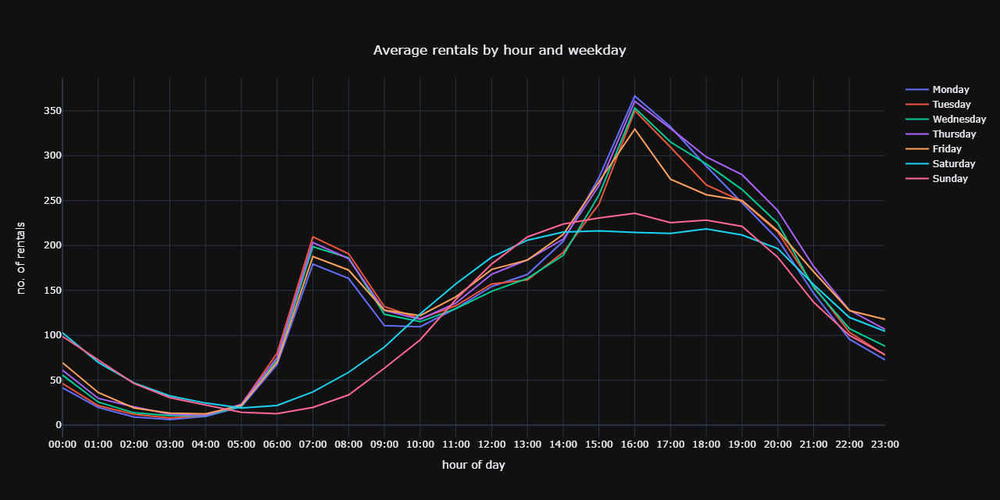

# Wroclaw Bikesharing System Analysis
==============================

## Overview
As part of the free transport data service, Wroclaw Bikesharing System (WRM) release data on journeys taken using their cycles. The data goes back to June 2019, showing information on the start and end locations of the journey along with time of day. By combining this information with the coordinates of each cycle hire point, I predicted the most likely journey taken for each start/end combination.

## Table of contents
1. [WRM Dataset](#dataset)
2. [Basic statistics](#statistics)
3. [Usage patterns](#usage_patterns)
4. [Weather conditions usage patterns](#weather)
5. [Bike stations analysis](#stations)
6. [Route predictions](#route)
7. [Conclusions](#conclusions")
8. [Project organisation](#project)

## WRM Dataset 
Wroclaw host all of the raw cycle data on their [open data website](https://www.wroclaw.pl/open-data/dataset/wrmprzejazdy_data) as a series of CSV files. Furthermore, they also have [data](https://www.wroclaw.pl/open-data/dataset/nextbikesoap_data) showing the status of each bike point in Wroclaw, yielding information such as its coordinates, total capacity etc.

## Basic statistics 
- number of bikes
- number of docking stations
- total number of rentals
- total number of valid rentals (>5 minutes and not between the same station)
- most popular docking station / least popular docking station
- most popular bike  / least popular bike
- most popular paths / least popular paths
- average rental time
- record day
- record month

## Usage patterns 
(How does usage change across the year, the week, and the day?)
(Are people mostly using Bike Share as a way to commute to work or to explore the city?)

### Total and average bike rides by month

[Interactive plot](https://nbviewer.jupyter.org/github/sebastian-konicz/WRM/blob/master/notebooks/reports/RidingPatternsPlots.ipynb#monthAggPlot)

[Interactive plot](https://nbviewer.jupyter.org/github/sebastian-konicz/WRM/blob/master/notebooks/reports/RidingPatternsPlots.ipynb#monthAvgPlot)

### Total bike rides by day

[Interactive plot](https://nbviewer.jupyter.org/github/sebastian-konicz/WRM/blob/master/notebooks/reports/RidingPatternsPlots.ipynb#dayAggPlot)

### Total and average bike rides by day of the week

[Interactive plot](https://nbviewer.jupyter.org/github/sebastian-konicz/WRM/blob/master/notebooks/reports/RidingPatternsPlots.ipynb#weekdayAggPlot)

[Interactive plot](https://nbviewer.jupyter.org/github/sebastian-konicz/WRM/blob/master/notebooks/reports/RidingPatternsPlots.ipynb#weekdayAvgPlot)

### Bike rides across time of the day

[Interactive plot](https://nbviewer.jupyter.org/github/sebastian-konicz/WRM/blob/master/notebooks/reports/RidingPatternsPlots.ipynb#hourAggPlot)

[Interactive plot](https://nbviewer.jupyter.org/github/sebastian-konicz/WRM/blob/master/notebooks/reports/RidingPatternsPlots.ipynb#hourAvgPlot)

[Interactive plot](https://nbviewer.jupyter.org/github/sebastian-konicz/WRM/blob/master/notebooks/reports/RidingPatternsPlots.ipynb#hourAvgWDPlot)

[Interactive plot](https://nbviewer.jupyter.org/github/sebastian-konicz/WRM/blob/master/notebooks/reports/RidingPatternsPlots.ipynb#hourAvgMonthPlot)

###Histogram of rental time (comparison between workdays and weekends).

[Source / Inspiration](https://medium.com/analytics-vidhya/how-to-finish-top-10-percentile-in-bike-sharing-demand-competition-in-kaggle-part-1-c816ea9c51e1)

## Weather conditions usage patterns 
(How does the weather change the way people use Bike Share?)
- correlation between weather conditions and bike usage (temp, percipitation, wind and humidity)
[Source / Inspiration](https://towardsdatascience.com/exploring-toronto-bike-share-ridership-using-python-3dc87d35cb62)

## Bike stations analysis 
### Map of all docking stations
Below I present to you a map of all the cycle hire stations across Wroclaw and surrounding areas.

I've also generated an interactive version of this plot in folium - click [here](https://sebastian-konicz.github.io/WRM/images/sites/DockingStationsMap.html) to see it. You can zoom/scroll with this version, and it also tells you the name of each location.

### Analysis of flows between stations
#### Net arivals/departures in the morning

[Interactive map](https://sebastian-konicz.github.io/WRM/images/sites/NetArivalsDepartures-morning.html)

#### Net arivals/departures in the afternoon

[Interactive map](https://sebastian-konicz.github.io/WRM/images/sites/NetArivaslDepartures-afternoon.html)

#### Intensity of arivals/departures in the morning

#### Intensity of arivals/departures in the morning

[Source / Inspiration](https://github.com/charlie1347/TfL_bikes)

### Ranking of bike stations
#### Most and least popular bike stations
#### Redistribution mismatch (outflow - inflow)

### Page rank algorithm

### Network analysis of bike stations
- bike paths graph

## Route predictions 
#### Route prediction graph
( to be added in the future)
[Source / Inspiration](https://github.com/charlie1347/TfL_bikes)

## Conclusions 
( to be added in the future)

## Project Organization 
------------

    ├── LICENSE
    ├── Makefile           <- Makefile with commands like `make data` or `make train`
    ├── README.md          <- The top-level README for developers using this project.
    ├── data
    │   ├── external       <- Data from third party sources.
    │   ├── interim        <- Intermediate data that has been transformed.
    │   ├── processed      <- The final, canonical data sets for modeling.
    │   └── raw            <- The original, immutable data dump.
    │
    ├── docs               <- A default Sphinx project; see sphinx-doc.org for details
    │
    ├── models             <- Trained and serialized models, model predictions, or model summaries
    │
    ├── notebooks          <- Jupyter notebooks. Naming convention is a number (for ordering),
    │                         the creator's initials, and a short `-` delimited description, e.g.
    │                         `1.0-jqp-initial-data-exploration`.
    │
    ├── references         <- Data dictionaries, manuals, and all other explanatory materials.
    │
    ├── reports            <- Generated analysis as HTML, PDF, LaTeX, etc.
    │   └── figures        <- Generated graphics and figures to be used in reporting
    │
    ├── requirements.txt   <- The requirements file for reproducing the analysis environment, e.g.
    │                         generated with `pip freeze > requirements.txt`
    │
    ├── setup.py           <- makes project pip installable (pip install -e .) so src can be imported
    ├── src                <- Source code for use in this project.
    │   ├── __init__.py    <- Makes src a Python module
    │   │
    │   ├── data           <- Scripts to download or generate data
    │   │   └── make_dataset.py
    │   │
    │   ├── features       <- Scripts to turn raw data into features for modeling
    │   │   └── build_features.py
    │   │
    │   ├── models         <- Scripts to train models and then use trained models to make
    │   │   │                 predictions
    │   │   ├── predict_model.py
    │   │   └── train_model.py
    │   │
    │   └── visualization  <- Scripts to create exploratory and results oriented visualizations
    │       └── visualize.py
    │
    └── tox.ini            <- tox file with settings for running tox; see tox.testrun.org

--------

<small>Project based on the <a target="_blank" href="https://drivendata.github.io/cookiecutter-data-science/">cookiecutter data science project template</a>. #cookiecutterdatascience</small>

