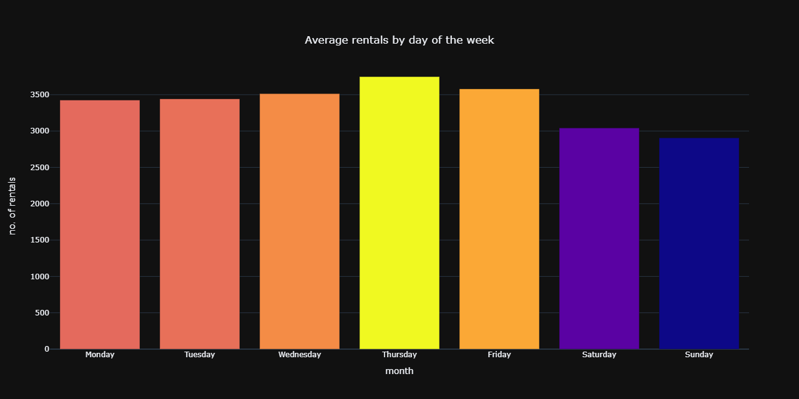
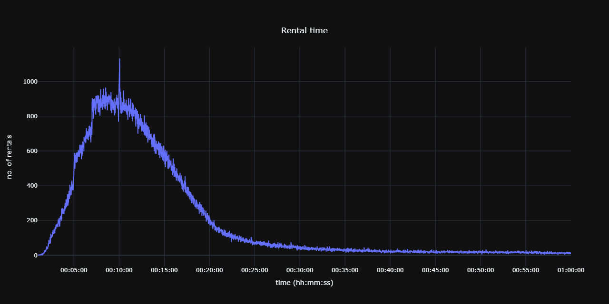

# Wroclaw Bikesharing System Analysis
==============================

## Overview
As part of the free transport data service, Wroclaw Bikesharing System (WRM) release data on journeys taken using their cycles. The data goes back to April 2015, showing information on the start and end locations of the journey along with time of day. By combining this information with the coordinates of each cycle hire point, I analyzed rental patterns among users (i.a. most popular destinations and paths), popularity of certain docking stations and corelation of rentals with weather conditions.

## Table of contents
1. [WRM Dataset overview](#dataset)
2. [Basic statistics](#statistics)
3. [Rental patterns](#rental_patterns)
4. [Weather conditions usage patterns](#weather)
5. [Bike stations analysis](#stations)
6. [Route predictions](#route)
7. [Conclusions](#conclusions")
8. [Project organisation](#project)

## WRM datasets overview 
Wroclaw host all of the raw cycle data on their [open data website](https://www.wroclaw.pl/open-data/dataset). There are two types of data availavle on the site
1. [Actual data for bike rentals in 2019](https://www.wroclaw.pl/open-data/dataset/wrmprzejazdy_data/resource_history/65b5015e-070e-41da-8852-802a86442ac5)
2. [Historical data for years 2015 - 2016](https://www.wroclaw.pl/open-data/dataset/przejazdy-wroclawskiego-roweru-miejskiego-archiwalne)

Furthermore, they also have [data](https://www.wroclaw.pl/open-data/dataset/nextbikesoap_data) showing the status of each bike point in Wroclaw, yielding information such as its coordinates, total capacity etc.

I've looked in both sets of data (actual and historical). First dataset can be easily scraped from the internet (it is a series of CSV files), nevertheless a cursory review of the data reveals gaps in their continuity, e.g. there are separate files for periods from 2019-06-26 to 2019-07-14 but all those files have rental data only for 2019-06-26. Therefore, huge gaps in continuity of data prevent proper analysis of rental trends.

Second set of data seems to be more consistent in terms of continuity, but the 2016 dataset has one crucial error i.e. from the first period to the end of October 2016 the starting station is the same as the end station.

Given the above my analysis will concentrate only on the 2015 dataset with total number of rows equal to 843 951.

### 2015 dataset
On the first glance the 2015 dataset is complete and consistent (no NaN values or missing data). Nevertheless after closer look there are few issues concernig 2015 data.

#### Rental data vs docking stations data
First issue with the 2015 dataset is connected with docking stations data i.e. the names of docking stations in rental dataset do not match the names in docking stations dataset. Given the above, before merging two datasets, I had to manually add new column in docking station dataset and match the old names with the new ones. As a result of the above I have discovered that there are 3 docking stations that were present in the 2015 but are not present today. These are:
1. Wyszyńskiego - Prusa
2. Teatralna - Piotra Skargi
3. Plac Nowy Targ

I have added them to the docking station dataset, gave them arbitrary ids and set respective gps coordinates using google maps.
Furthermore, I have discovered that there were 8 docking stations which were present in 2015 (but are not present today) and had only 1 or 2 rides.  These are: Dworzec Głowny PKP, Grunwaldzka / Grochowska, Most Teatralny, Ogrody, Pętla Autobusowa - Dambonia, Plac Wolnosci, Poznań Główny, Wiejska / Pogodna.
Above stations were excluded from the dataset thus reducing the number of records from 843 951 to 843 937 (difference = 14).

#### Valid rentals based on location and duration
As a user of similar bike sharing system in my hometown (Warsaw) I know that often (especially when there are few bikes in the docking station) rented bikes do not work properly. Usually user is able to spot defected bike right away (flat tire), but many times bike defects are apparent only after brief ride.
As a result some portion of bike rentals is "invalid" i.e. user returns the bike to docking station after discovering the defect. Given the above i have dropped from the dataset the rides that were made between the same docking station and shorter than 5 minutes. Obviously the time value is arbitrary and can be changed in other analyzes, but in my opinion it is hard to believe that many users rent a bike for such small amount of time only to return it in the same docking station.
Given the above constraints, dataset was reduced from 843 937 to 735 444 records (difference = 108 493).

Note: As the estimated number of invalid rentals is significant (12,8% of initial records) this issue will be the subject of a separate analysis in one of the chapters in the future.

#### Daylight saving time and negative duration
Due to change from summer time to winter time on 25 October 2015 i.e. retarding clocks by one hour at 3:00 am, some of the bike rentals had negative values. Obviously these values had to be removed from the dataset for further analysis, hence reducing number of records form 735 444 to 735 439 (difference = 5).

#### Speed
Usually the bike sharing system uses heavy and robust bikes which are not susceptible to mechanical failure and therefore they do not reach dizzying speeds. As an avid road cycling enthusiast with fairly good physical form, I know that it is very hard to accelerate such bike to a speed exceeding 25 km/h ipso facto I have limited the dataset to rides which on average do not exceed 25 km/h.
This procedure not only eliminates obvious errors in the bike sharing system, but also excludes rides that could have been done using other means of public transport (transporting a bicycle by bus or tram).
As a result, the dataset has been reduced from 735 439 to 733 939 (difference = 1 500).

## Basic statistics 
Based on the cleaned up dataset i have prepared a table with basic statistics concerning bike sharing system in Wroclaw.
Readers can confront the data presented below with the official statistics available (in polish) on this [site](https://www.wroclaw.pl/wroclawski-rower-miejski-podsumowanie-sezonu-2015).
Of course the numbers differ because bike sharing operator overstates its statistics (for marketing purposes) by including all rentals (even the invalid ones).

- number of bikes
- number of docking stations
- total number of valid rentals
- most popular docking station
- most popular bike
- most popular path
- average rental time
- average speed
- record day
- record month

## Rental patterns 
In this chapter i will analyze the rental patterns of users in order to answer such questions as:
- how does usage change across the year, the week, and the day;
- are people mostly using bike sharing system as a way to commute to work or to explore the city.

The following analysis was performed using charts prepared in plotly python library. Under each image there is a link to an interactive version of the chart.

### Total and average bike rides by month
First of all, the subject of the analysis is the total number of bicycle rentals per month and its average value.

As you can see in the charts below, the most popular months (both in terms of total and average loans) were May and June. The next in order were the months during the holiday period (July and August). Finally, the following months have seen a gradual decline in the popularity of the system (most likely due to worsening weather conditions).

In the case of April, the analysis is difficult because the system was launched on the 28th of this month.

From the analyst's point of view, the difference in the popularity of the system between typically summer months (July, August) and spring months (May, June) may be interesting. In my opinion, the fewer users in the summer months can be reduced to two main reasons:
1. Summer months are holiday season in Poland, therefore some of the system's users (employees commuting to work) are on holiday away from home.
2. Wroclaw is one of the main academic cities in Poland. During the summer months, most students stay outside Wroclaw (in their hometowns), reducing the number of active system users.

The correctness of the second statement is confirmed after analyzing the most popular user routes (see the chapter [Bike statnions analysis](#stations)). The top ten most popular routes included, among others, those leading from the dormitory (docking station: Wróblewskiego (Teki)) to the main building of the Wroclaw University of Technology (docking station: Norwid / Wyspiański (PWr) or to the stations near the main campus (Łukasiewicza / Smoluchowski (PWr), Rondo Regana).

[Interactive plot](https://nbviewer.jupyter.org/github/sebastian-konicz/WRM/blob/master/notebooks/reports/RidingPatternsPlots.ipynb#monthAggPlot)

[Interactive plot](https://nbviewer.jupyter.org/github/sebastian-konicz/WRM/blob/master/notebooks/reports/RidingPatternsPlots.ipynb#monthAvgPlot)

### Total bike rides by day
Secondly, the subject of the analysis is the total number of bike rentals on a given day and the average number of rentals per day of the week.

In the case of the total daily number of rentals, the trend described in the previous paragraph can be clearly seen. The peak of the system's popularity falls on May and June, while in the following months a gradual decrease in the number of bicycle rentals is visible.
In addition, the graph showing the average number of rentals per weekday shows that bicycles are more popular on business days than on weekends, which may suggest that residents use bicycles mainly as a means of communication on the way to work.

In addition, the daily chart clearly shows 3 days in which the number of rentals clearly deviated from the norm. These are:
a. May 20 (Wednesday);
b. September 6 (Sunday);
c. November 15 (Sunday).
It can be assumed that a clear deviation from the standard in terms of loans (2-3 times smaller than on neighboring days) may be due to a faulty data set for these days i.e. the system saved only a part of the loans that took place on those days.

[Interactive plot](https://nbviewer.jupyter.org/github/sebastian-konicz/WRM/blob/master/notebooks/reports/RidingPatternsPlots.ipynb#dayAggPlot)

### Average bike rides by day of the week

[Interactive plot](https://nbviewer.jupyter.org/github/sebastian-konicz/WRM/blob/master/notebooks/reports/RidingPatternsPlots.ipynb#weekdayAvgPlot)

### Bike rides across time of the day

[Interactive plot](https://nbviewer.jupyter.org/github/sebastian-konicz/WRM/blob/master/notebooks/reports/RidingPatternsPlots.ipynb#hourAggPlot)

[Interactive plot](https://nbviewer.jupyter.org/github/sebastian-konicz/WRM/blob/master/notebooks/reports/RidingPatternsPlots.ipynb#hourAvgPlot)

[Interactive plot](https://nbviewer.jupyter.org/github/sebastian-konicz/WRM/blob/master/notebooks/reports/RidingPatternsPlots.ipynb#hourAvgWDPlot)

[Interactive plot](https://nbviewer.jupyter.org/github/sebastian-konicz/WRM/blob/master/notebooks/reports/RidingPatternsPlots.ipynb#hourAvgMonthPlot)

### Bike rides duration

[Interactive plot](https://nbviewer.jupyter.org/github/sebastian-konicz/WRM/blob/master/notebooks/reports/RidingPatternsPlots.ipynb#durationAggPlot)

[Source / Inspiration](https://medium.com/analytics-vidhya/how-to-finish-top-10-percentile-in-bike-sharing-demand-competition-in-kaggle-part-1-c816ea9c51e1)

## Weather conditions usage patterns 
(How does the weather change the way people use Bike Share?)
- correlation between weather conditions and bike usage (temp, percipitation, wind and humidity)
[Source / Inspiration](https://towardsdatascience.com/exploring-toronto-bike-share-ridership-using-python-3dc87d35cb62)

## Bike stations analysis 
### Map of all docking stations
Below I present to you a map of all the cycle hire stations across Wroclaw and surrounding areas.

I've also generated an interactive version of this plot in folium - click [here](https://sebastian-konicz.github.io/WRM/images/sites/DockingStationsMap.html) to see it. You can zoom/scroll with this version, and it also tells you the name of each location.

### Analysis of flows between stations
In the images below, orange represents a station with more bikes leaving than coming in (outflows > inflows), whilst blue represents the opposite. As expected, in the morning people commute in to the centre from the suburbs, whilst the opposite occurs in the evening.
#### Net arivals/departures in the morning (working days)

[Interactive map](https://sebastian-konicz.github.io/WRM/images/sites/NetArivalsDepartures-morning.html)

#### Net arivals/departures in the afternoon (working days)

[Interactive map](https://sebastian-konicz.github.io/WRM/images/sites/NetArivaslDepartures-afternoon.html)

#### Intensity of arivals/departures in the morning (working days)

#### Intensity of arivals/departures in the afternoon (during weekdays)

[Source / Inspiration](https://github.com/charlie1347/TfL_bikes)

### Ranking of bike stations
#### Most and least popular bike stations
#### Redistribution mismatch (outflow - inflow)

### Page rank algorithm

### Network analysis of bike stations
#### Bike path in Wroclaw

[Interactive map](https://sebastian-konicz.github.io/WRM/images/sites/BikePathsMapTreshold.html)

## Route predictions 
#### Route prediction graph
( to be added in the future)
[Source / Inspiration](https://github.com/charlie1347/TfL_bikes)

## Conclusions 
( to be added in the future)

## Project Organization 
------------

    ├── LICENSE
    ├── Makefile           <- Makefile with commands like `make data` or `make train`
    ├── README.md          <- The top-level README for developers using this project.
    ├── data
    │   ├── external       <- Data from third party sources.
    │   ├── interim        <- Intermediate data that has been transformed.
    │   ├── processed      <- The final, canonical datasets for modeling.
    │   └── raw            <- The original, immutable data dump.
    │
    ├── docs               <- A default Sphinx project; see sphinx-doc.org for details
    │
    ├── models             <- Trained and serialized models, model predictions, or model summaries
    │
    ├── notebooks          <- Jupyter notebooks. Naming convention is a number (for ordering),
    │                         the creator's initials, and a short `-` delimited description, e.g.
    │                         `1.0-jqp-initial-data-exploration`.
    │
    ├── references         <- Data dictionaries, manuals, and all other explanatory materials.
    │
    ├── reports            <- Generated analysis as HTML, PDF, LaTeX, etc.
    │   └── figures        <- Generated graphics and figures to be used in reporting
    │
    ├── requirements.txt   <- The requirements file for reproducing the analysis environment, e.g.
    │                         generated with `pip freeze > requirements.txt`
    │
    ├── setup.py           <- makes project pip installable (pip install -e .) so src can be imported
    ├── src                <- Source code for use in this project.
    │   ├── __init__.py    <- Makes src a Python module
    │   │
    │   ├── data           <- Scripts to download or generate data
    │   │   └── make_dataset.py
    │   │
    │   ├── features       <- Scripts to turn raw data into features for modeling
    │   │   └── build_features.py
    │   │
    │   ├── models         <- Scripts to train models and then use trained models to make
    │   │   │                 predictions
    │   │   ├── predict_model.py
    │   │   └── train_model.py
    │   │
    │   └── visualization  <- Scripts to create exploratory and results oriented visualizations
    │       └── visualize.py
    │
    └── tox.ini            <- tox file with settings for running tox; see tox.testrun.org

--------

<small>Project based on the <a target="_blank" href="https://drivendata.github.io/cookiecutter-data-science/">cookiecutter data science project template</a>. #cookiecutterdatascience</small>

